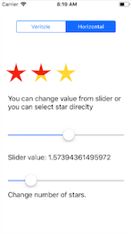
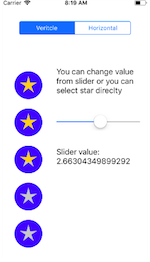

# StarRating
This is component help you design star rating with highly customization. You can customize colors, number of starts, direction of star. You can also use this for taking input from user. It also supports interface builder design.




## Installation

### CocoaPods

[CocoaPods](http://cocoapods.org) is a dependency manager for Cocoa projects. You can install it with the following command:

```bash
$ gem install cocoapods
```

To integrate ***MBStarRating*** into your Xcode project using CocoaPods, specify it in your `Podfile`:

```ruby
target '<Your Target Name>' do
    pod 'MBStarRating'
end
```

Then, run the following command:

```bash
$ pod install
```


##How to Use

You can assign a class **MBStarRatingView** is your view direclty in storyboard. If want more specific for direction then you can use any of the calss ***MBStarRatingVerticalView*** or ***MBStarRatingHorizontalView***.

> Note: **MBStarRatingView** is only supports **UIView** and not other UI components.


####Basic Customization
```swift
ratingView.maxRating = 5
ratingView.rating = 5
ratingView.activeColor =  UIColor.<YourColor>
ratingView.incativeColor =  UIColor.<YourColor>
ratingView.circleColor =  UIColor.<YourColor>
``` 

> Note: You can do this in Interface Builder directly and view how it looks.
 
 
####Higly Customization

**MBStarRating** support highly customization. Like you can have seperate start color for each star with in the same view. You can also decide the fill direction of each indivisual star with in same view.

```swift
ratingView.starDelegate = object
``` 

```swift
public protocol MBStarDelegate: class {
    func starRating(view: MBStarRatingView, fillDirectionForStarAt index: Int) -> MBStarBezierPath.Direction
    func starRating(view: MBStarRatingView, fillColor index: Int) -> StarColor
}
```

##Licence

**[MIT](LICENSE)**
